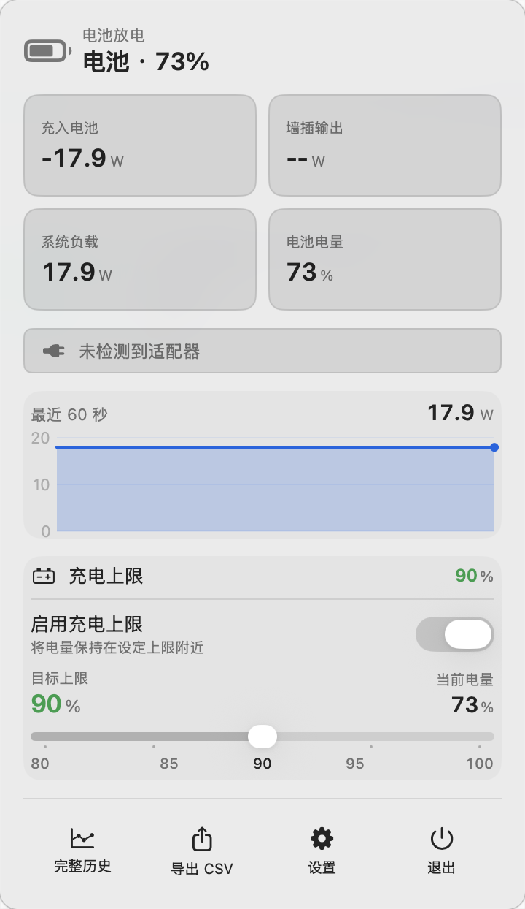
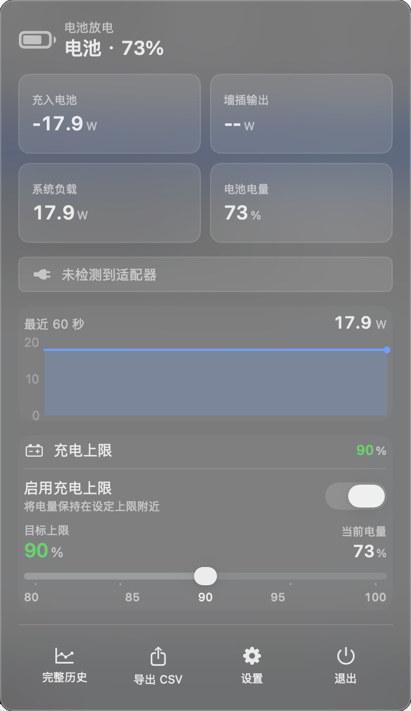

<div align="center">

# ChargeWatch

**macOS 菜单栏充电功率监控 + 原生级电池充电上限**

实时看清每一瓦电流向，在电量达到上限后让电池真正"静置"——不充也不放，整机改由电源适配器直供。

[](https://www.apple.com/macos/)
[](#系统要求)
[](https://swift.org)
[](https://github.com/TY-teo/ChargeWatch/releases)
[](LICENSE)

<table>
  <tr>
    <td></td>
    <td></td>
  </tr>
</table>

</div>

---

## 这是什么

ChargeWatch 是一款常驻 macOS 菜单栏的小工具，做两件事，并且都做到位：

1. **看清功率** —— 把"充进电池多少瓦""系统自己用掉多少瓦""墙插实际输出多少瓦"分别拆开显示，数据来自硬件遥测的瞬时电压乘电流，而不是适配器铭牌上的额定数字。
2. **守住电池** —— 你可以设一个充电上限（默认 80%）。到达上限后，ChargeWatch 让电池停止充电，但**不断开电源适配器**：整机改由适配器直供，电池电流被钳在约 0，既不充也不放，安安静静停在上限附近。

它不是简单地"充满就拔电再放电"，而是采用更护电池的"停充不放电"路线。下面两章会把原理讲透。

---

## 功能特性

- **三路功率拆解**：充入电池、系统负载、墙插输出，分别独立显示。
- **瞬时实测**：以约 1Hz 采样，插拔电源或充放电状态切换时立即补采刷新。
- **原生级充电上限**：直接写 Apple Silicon 的 SMC 寄存器控制充电，不依赖快捷指令、不依赖第三方内核扩展。
- **停充不放电**：到上限后电池静置、适配器直供，不人为制造额外充放循环。
- **5% 滞回**：电量掉超过 5% 才回充，避免在上限点反复微充放。
- **每 7 天满充校准**：定期放行充满一次，维持系统电量计读数准确。
- **Fail-safe 兜底**：守护进程退出、被杀、读取异常时，一律自动恢复正常充电。
- **纯本地、零联网**：所有数据留在本机 SQLite，不上传、不追踪。
- **原生 SwiftUI 界面**：跟随系统浅色 / 深色外观，菜单栏轻量常驻。

---

## 截图

<div align="center">

<table>
  <tr>
    <td align="center"><br/><sub>浅色模式</sub></td>
    <td align="center"><br/><sub>深色模式</sub></td>
  </tr>
</table>

</div>

---

## 系统要求

| 能力 | 要求 |
| --- | --- |
| 功率监控 | macOS 13 及以上 |
| 充电上限 | Apple Silicon（M 系列芯片），已在 macOS 26.4 Tahoe 实测 |

> 充电上限通过写入 Apple Silicon 专有的 SMC 充电控制键实现，因此仅在 Apple Silicon 机型上可用；Intel Mac 可正常使用功率监控部分。

---

## 下载与安装

### 1. 下载

前往 [Releases](https://github.com/TY-teo/ChargeWatch/releases) 下载 `ChargeWatch-0.6.0.zip`，解压后把 `ChargeWatch.app` 拖入"应用程序"。

### 2. 首次打开（ad-hoc 签名）

本应用使用 ad-hoc 签名（个人开源分发，未走 Apple 公证），首次打开时系统会拦截。任选一种方式放行：

**方式一：右键打开**

在应用上点右键（或按住 Control 单击）选择"打开"，在弹窗里再次点"打开"。此后双击即可正常启动。

**方式二：移除隔离属性**

```bash
xattr -dr com.apple.quarantine /Applications/ChargeWatch.app
```

### 3. 首次开启充电上限

充电上限需要一个以 root 运行的守护进程来写 SMC。第一次在 App 里打开充电上限开关时，系统会**弹出一次管理员密码**用于安装守护进程（`com.chenran.chargewatch.helper`）。之后由 `launchd` 托管自启，不会再反复要求密码。

---

## 使用

1. 启动后图标常驻菜单栏，点击展开面板即可看到三路功率读数。
2. 在面板中拖动充电上限滑块设置目标百分比（建议 60%–80%）。
3. 打开充电上限开关，按提示输入一次管理员密码完成守护进程安装。
4. 之后电量到达上限会自动停充、由适配器供电，无需任何手动操作。

---

## 保护电池：到上限后电池不放电，只走适配器供电

这是 ChargeWatch 与许多同类工具最关键的差异，也是它"真正护电池"的核心。

### 它怎么做

当电量达到你设定的上限时，守护进程向 SMC 写入充电控制键 `CHTE = 1`，含义是 **"停止充电，但保持电源适配器供电，电池不放电"**。与此同时，它**刻意不去断开适配器**（断开适配器的 `CHIE` 键保持接通状态）。

结果是三件事同时成立：

- 系统依然认为外接电源在位（`ExternalConnected = Yes`）；
- 电池电流被钳在约 0 —— **既不充电，也不放电**；
- 整机用电改由电源适配器直接供给。

于是电池就静静停在上限附近，几乎不参与任何能量进出。它既不会被长期推到、停在 100% 满电（高电压满电是锂电池日历老化的主要诱因），也不会被人为制造一充一放的微循环（充放循环数是锂电池寿命的另一主要消耗项）。两项主要损耗被同时压低。

### 为什么不直接"断开适配器放电到上限"

市面上一类工具靠写"断开适配器"来强行掉电维持上限。这种做法有三个问题：

- **真的在放电**：明明插着电，却靠耗电池来维持上限，每次掉下去又要充回来，人为制造了额外的微充放循环。
- **状态被污染**：断开适配器会把系统读到的外接电源状态变成"未插电"，叠加电池状态刷新缓慢，容易产生"限充 → 误判拔电 → 松手 → 再限充"的高频抖动。
- **发热与应力**：放电会发热，并增加满电附近的循环应力。

ChargeWatch 走的是相反的路线。

### 两种方案对比

| 维度 | ChargeWatch（CHTE 停充） | 断适配器方案 |
| --- | --- | --- |
| 上限达到后电池状态 | 停充不放电，电流约 0 | 持续放电 |
| 整机供电来源 | 电源适配器直供 | 电池供电 |
| 是否增加充放循环 | 不增加（电池静置） | 增加（反复微充放） |
| 外接电源状态读数 | 保持稳定（Yes） | 易被污染、抖动 |
| 发热与循环应力 | 低 | 较高 |

### 配套的稳妥设计

- **物理在位判断更可靠**：是否插着电，优先读 SMC 的 `AC-W` 键（按字节判断），而不是会被充电控制逻辑污染、刷新又慢的系统状态，从根上消除了抖动反馈环。
- **5% 滞回**：到上限停充后，只有电量自然下滑超过 5% 才会回充，中间区间维持现状。停充语义下电池基本只靠自然漏电缓慢下降，回充事件极少发生。
- **每 7 天满充校准**：距上次满充满 7 天时放行一次充到 100%，仅用于校准系统电量计、维持百分比估算准确，并非常态充满（设为 0 可关闭）。
- **启动时探测执行器**：只要本机支持 charge-disable 语义就优先用 `CHTE`（不放电）；只有完全不支持时才退而使用断适配器作为兜底。每次写 SMC 都会回读校验，确保命令真正生效。
- **Fail-safe 异常恢复**：收到终止信号、进程退出、读电池失败、未启用、上限为 100、未插电等任何异常情况，都先恢复正常充电。守护进程由 `launchd` 以 `KeepAlive` 托管，崩溃会被自动重启。

---

## 功率是怎么算的、为什么准

很多电量工具直接读适配器铭牌的额定功率（比如 67W、96W），或读取一些会"虚高 / 失真"的聚合字段。ChargeWatch 选择从最底层的硬件遥测取**瞬时电压 × 瞬时电流**，再用能量守恒推导，因此读数贴近真实。

### 三个指标的来源与公式

| 指标 | 数据来源（硬件遥测） | 公式 |
| --- | --- | --- |
| **充入电池** | 电池库仑计上报的 `Voltage`(mV) 与 `InstantAmperage`(mA) | `幅度 = 绝对值(电压 × 电流) / 1_000_000`（mV×mA→W）；方向由 `IsCharging` 决定：充电为正、放电为负 |
| **系统负载** | `SystemPowerIn`(进入 Mac 的总功率) 与上面算出的充入电池功率 | `系统负载 = max(0, SystemPowerIn − 充入电池功率)`；纯电池供电时则等于电池放电幅度 |
| **墙插输出** | `SystemPowerIn` 与 `AdapterEfficiencyLoss`(适配器转换损耗) | `墙插输出 = (SystemPowerIn + AdapterEfficiencyLoss) / 1000` |

### 直白解释

- **充入电池**：电池此刻的电压（伏）乘以流进电池的电流（安），就是灌进电池的功率（瓦）。优先用 `InstantAmperage`（瞬时电流，插电立刻反映）；读不到时回退到几秒平均的 `Amperage`（会略滞后）。最后按充电 / 放电标志决定正负。
- **系统负载**：芯片、屏幕等真正消耗的功率，用能量守恒倒推 —— 接着电源时，进入 Mac 的总功率里有一部分灌进了电池，剩下的就是系统自己用掉的。没接电源时，电池放出的功率全部被系统用掉，系统负载就等于电池放电幅度。
- **墙插输出**：从插座 / 适配器实际拉了多少瓦 = 真正进入 Mac 的功率 + 适配器自身转换时损耗的功率。注意它不是适配器铭牌上的额定值，额定值仅用于显示描述。

### 为什么准

- **用瞬时 V×I，不用估算或铭牌值**：充入电池的功率直接来自电池库仑计 / 充电控制器实测上报的瞬时电压与电流，相乘即得，不掺任何额定值。
- **刻意避开失真字段**：实测中某些聚合字段"电池功率"约报 8W，而真实充电约 56W；"系统负载"字段会虚高约 6 倍。因此 ChargeWatch 改用瞬时 V×I 加能量守恒来推导，而非直接读取这些字段。
- **总输入与硬件读数一致**：墙插输出 / 总输入基于 `SystemPowerIn`，其数值与 `system_profiler` 的适配器读数一致，属硬件遥测实测。
- **有符号解码正确**：电流以无符号 64-bit 编码，代码用 64 位再转回带符号，避免了用 32 位截断导致充放电数值变负的常见 bug。

### 几点说明

- 显示的是约每秒一次的瞬时快照，不是连续积分。
- 接电但某些字段在采样间隙读到 0 时，相关读数记为"无数据"而非 0。
- 系统负载用 `max(0, …)` 钳到非负，极端读数误差会被截到 0。
- 桌面机 / 无电池机型自动降级：仅显示市电运行状态，不显示电池相关读数。

---

## 透明度与彻底卸载

ChargeWatch 会在系统里留下三处与充电上限相关的痕迹，全部公开可查：

| 类型 | 路径 / 标识 |
| --- | --- |
| LaunchDaemon | `/Library/LaunchDaemons/com.chenran.chargewatch.helper.plist` |
| 守护进程二进制 | `/Library/PrivilegedHelperTools/com.chenran.chargewatch.helper` |
| 配置文件 | `/Users/Shared/ChargeWatch/smc-limit.json` |
| SMC 充电控制键 | `CHTE`（停充 / 允许充电）、必要时 `CHIE`（断 / 接适配器） |

### 彻底卸载

执行卸载脚本会停止并移除守护进程，并**自动恢复正常充电**（写回 `CHTE=0`、`CHIE=0`）：

```bash
sudo bash scripts/install-helper.sh uninstall
```

随后把 `ChargeWatch.app` 拖进废纸篓即可。本地数据库可一并删除：

```bash
rm -rf ~/Library/Application\ Support/ChargeWatch
```

---

## 隐私

ChargeWatch 是纯本地应用，**不联网、不上传、不追踪任何数据**。所有功率采样历史只保存在本机：

```
~/Library/Application Support/ChargeWatch/data.sqlite
```

删除该文件即清空全部历史。

---

## 从源码构建

环境：安装 Xcode / Swift 工具链（Swift 5.9+）。

```bash
git clone https://github.com/TY-teo/ChargeWatch.git
cd ChargeWatch

# 开发运行
swift run

# 构建打包为 .app
bash scripts/build-app.sh
```

充电上限守护进程的安装 / 卸载脚本：

```bash
# 安装（需 root，通常由 App 首次开启上限时自动调用）
sudo bash scripts/install-helper.sh install

# 卸载（恢复充电）
sudo bash scripts/install-helper.sh uninstall
```

---

## 技术栈

- **语言**：Swift 5.9，Swift Package Manager 构建。
- **界面**：SwiftUI + MenuBarExtra，跟随系统外观。
- **功率采样**：IOKit 读取 `AppleSmartBattery` 与 `PowerTelemetryData`，约 1Hz 定时采样 + `IOPSNotification` 电源状态变化即时补采。
- **充电控制**：以 root 运行的轻量守护进程直接读写 Apple Silicon SMC 寄存器，由 `launchd` 托管（`RunAtLoad` + `KeepAlive`）。
- **数据存储**：本地 SQLite，滚动窗口保留近期样本并下采样长期存档。

---

## 已知限制

- 充电上限仅支持 Apple Silicon 机型；Intel Mac 只能使用功率监控。
- ad-hoc 签名分发，首次打开需手动放行（右键打开或 `xattr`）。
- 直接读写 SMC 属于底层操作，不同机型 / 系统版本的键支持情况可能有差异；不支持 `CHTE` 的机型会退化为断适配器兜底方案。
- 功率读数为每秒一次的瞬时快照，不是连续能量积分。
- 已在 macOS 26.4 Tahoe + Apple Silicon 实测，其它版本组合可能存在差异。

---

## 致谢

ChargeWatch 在 SMC 充电控制的理解上，参考并致谢以下优秀的开源项目与资料：

- [charlie0129/batt](https://github.com/charlie0129/batt)
- [mhaeuser/Battery-Toolkit](https://github.com/mhaeuser/Battery-Toolkit)
- [AlDente](https://apphousekitchen.com/)
- Apple 官方文档：[HT102338](https://support.apple.com/102338)、[HT108055](https://support.apple.com/108055)

---

## 免责声明

ChargeWatch 会直接写入 SMC 充电控制寄存器。尽管项目内置了回读校验、5% 滞回、定期校准与多重 fail-safe 设计，**底层 SMC 写入仍存在固有风险，使用本软件即表示你理解并自行承担相应风险**。作者不对因使用本软件导致的任何硬件或数据问题负责。如有顾虑，请先阅读源码再决定是否使用。

---

## 许可证

本项目基于 [MIT 许可证](LICENSE) 开源。
